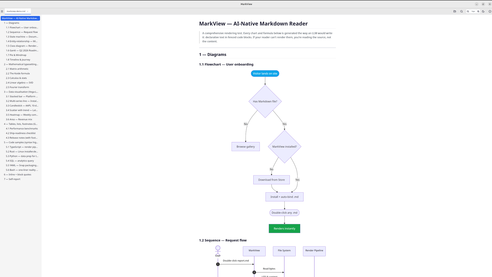
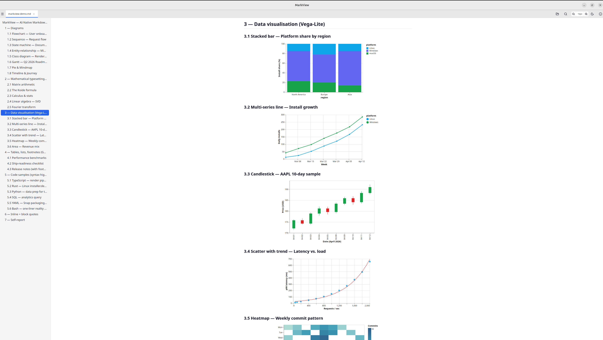
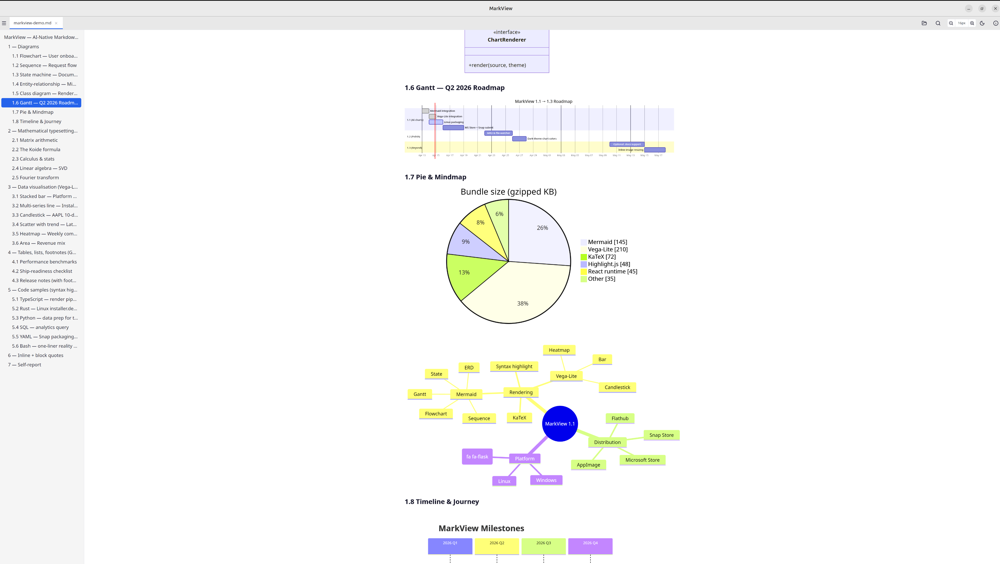
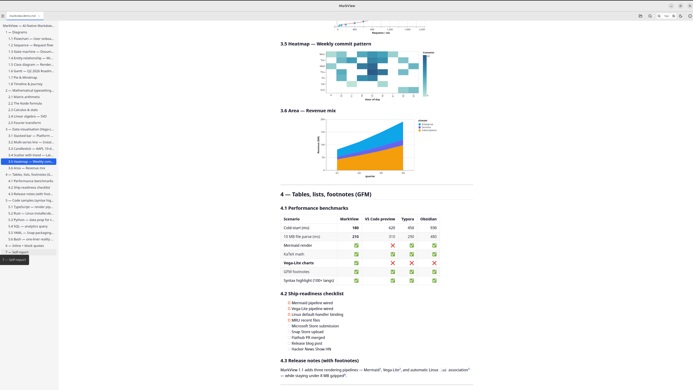

# MarkView

[](https://github.com/scos-lab/markview/releases)
[](LICENSE)

An AI-native Markdown reader for Windows and Linux — renders Mermaid
diagrams, KaTeX math, Vega-Lite charts, and GFM tables the way modern
LLMs produce them.

**Free and open source ([MIT](LICENSE)). No accounts, no ads, no telemetry, no network calls.**



### Gallery

| Data charts (Vega-Lite) | Diagrams (Mermaid) |
|---|---|
|  |  |

| Math + tables | Release notes view |
|---|---|
|  |  |

## When to Use

MarkView is a **reader**, not an editor. Open it when you want to:

- **See LLM output rendered immediately** — paste a Claude / ChatGPT / Gemini reply that contains Mermaid diagrams or Vega-Lite charts and see them as visuals, not raw JSON / code blocks. No copy-pasting into a separate site.
- **Read LLM-generated technical reports** — KaTeX math, GFM tables, syntax-highlighted code, and diagrams render in one consistent view.
- **Open a `.md` file and just read it** — release notes, README files, docs from a cloned repo. No editor UI in the way.

If you need editing, sync, plugins, or note-taking, [Obsidian](https://obsidian.md/), [Typora](https://typora.io/), and [MarkText](https://github.com/marktext/marktext) are great. MarkView is intentionally read-only and lightweight — no account, no sync, no telemetry.

## Download

### Windows

| Format | Link |
|---------|------|
| Microsoft Store | [Get it from Microsoft Store](https://apps.microsoft.com/detail/9n3cwdlvl9tq?hl=en-gb&gl=AU&ocid=pdpshare) |
| Portable (.exe) | [MarkView_v1.0.5_portable.exe](https://github.com/scos-lab/markview/releases/download/v1.0.5/MarkView_v1.0.5_portable.exe) |
| Installer (MSI) | [MarkView_v1.0.5_x64.msi](https://github.com/scos-lab/markview/releases/download/v1.0.5/MarkView.-.Markdown.Reader_1.0.5_x64_en-US.msi) |

> **Note:** Windows SmartScreen may warn about downloaded `.exe` / `.msi` files because they are not code-signed. To bypass: click **"More info"** → **"Run anyway"**. Alternatively, right-click the file → **Properties** → check **"Unblock"** → OK. The **Microsoft Store** version does not have this issue.

### Linux

| Format | Link | Notes |
|--------|------|-------|
| `.deb` (1.0.5) | [MarkView-1.0.5-amd64.deb](https://github.com/scos-lab/markview/releases/download/v1.0.5/MarkView-1.0.5-amd64.deb) | Ubuntu 24.04+, Debian 13+ (uses system WebKit) |
| `.AppImage` (1.0.5) | [MarkView-1.0.5-amd64.AppImage](https://github.com/scos-lab/markview/releases/download/v1.0.5/MarkView-1.0.5-amd64.AppImage) | Any distro with `libfuse2`, self-contained |
| Snap Store | [](https://snapcraft.io/markview-reader) | `sudo snap install markview-reader` |
| Flathub | `flatpak install io.github.scos-lab.MarkView` | *pending review* |

```bash
# .deb install
sudo dpkg -i MarkView-1.0.5-amd64.deb

# .AppImage install
chmod +x MarkView-1.0.5-amd64.AppImage
./MarkView-1.0.5-amd64.AppImage
```

After install, open the About panel and click "Set MarkView as default .md
handler" to bind `.md` files to MarkView system-wide.

### Linux Troubleshooting

| Symptom | Fix |
|---------|-----|
| `.AppImage` won't launch on Ubuntu 24.04 (`error while loading shared libraries: libfuse.so.2`) | `sudo apt install libfuse2t64` |
| `.deb` install fails with WebKit dependency error on older Debian / Ubuntu | `sudo apt install libwebkit2gtk-4.1-0` (or `-4.0-37` on older releases) |
| "Set as default" doesn't take effect | Run manually: `xdg-mime default markview-reader.desktop text/markdown` |
| Snap version can't open files outside home directory | `sudo snap connect markview-reader:removable-media` (and/or `:home`) |

## Features

- **Mermaid diagrams** — Flowchart, sequence, state, class, ERD, gantt,
  pie, mindmap, timeline, journey. Each type code-splits on demand.
- **Vega-Lite charts** — Bar, line, scatter, heatmap, candlestick,
  stacked area. Any data spec an LLM can emit as JSON renders as SVG.
- **KaTeX math** — Inline and block, matrices, integrals, series.
- **GFM** — Tables, task lists, footnotes, strikethrough, autolinks.
- **Syntax highlighting** — 100+ languages via highlight.js.
- **Table of Contents** — Auto-generated from headings with scroll spy.
- **Folder Browser** — Browse a directory tree of `.md` files.
- **In-Document Search** — Ctrl+F with highlight and navigation.
- **Dark / Light Theme** — Follows system preference or manual toggle.
  Charts re-render with theme-aware colors on switch.
- **Font Size Control** — Adjustable (12–28 px), persisted.
- **File Watching** — Auto-reloads when the file is modified externally.
- **Drag & Drop** — Drop `.md` files directly into the window.
- **Default `.md` Handler** — One-click "Set as default" on both
  platforms (Windows: auto-registers via registry; Linux: `xdg-mime default`).
- **Recent Files** — Last 10 opened files on the welcome screen.
- **Print** — Clean print output (content only).
- **Token Estimation** — Document stats with word count and estimated
  token count.

## Keyboard Shortcuts

| Shortcut | Action |
|----------|--------|
| `Ctrl+O` | Open file |
| `Ctrl+W` | Close current tab |
| `Ctrl+Tab` / `Ctrl+Shift+Tab` | Next / previous tab |
| `Ctrl+F` | Search in document |
| `Ctrl+B` | Toggle sidebar (TOC / folder browser) |
| `Ctrl+P` | Print |
| `Ctrl+Shift+T` | Toggle light / dark theme |
| `Ctrl+=` / `Ctrl+-` / `Ctrl+0` | Font size: increase / decrease / reset |

## Tech Stack

- **Tauri 2** (Rust) — Desktop framework (WebView2 on Windows, WebKit2GTK on Linux)
- **React 19** + TypeScript — Frontend UI
- **Vite 6** — Build tooling
- **TailwindCSS 4** — Styling
- **Zustand** — State management
- **Unified/Remark/Rehype** — Markdown processing pipeline

## How This Project Was Built

MarkView was born from a controlled experiment: **does the format of a specification affect the quality of LLM-generated code?**

We wrote the same app spec in three formats — Natural Language (NL), STL, and STLC — and gave each to a separate Google Gemini instance. Same 19 features, same tech stack, same prompt. The results:

| Metric | Natural Language | STL | STLC |
|--------|:---:|:---:|:---:|
| **Feature Completion** | 8.5/19 (45%) | **13/19 (68%)** | 10/19 (53%) |
| **Compiles?** | NO | **YES** | YES |
| **Fully Autonomous?** | NO | **YES** | NO |
| **Human Interventions** | 1+ | **0** | 1 |

**STL was the only format that compiled on the first attempt with zero human intervention.** The NL version didn't even compile (missing `build.rs`, broken regex). The STLC version compiled but missed practical details like CSS imports — correct logic, broken visuals.

### The Process

1. **Planning (Claude)** — Claude wrote the full application specification in STL format ([`plan_stl.md`](plan_stl.md)), encoding every feature, component, and dependency as typed semantic edges with explicit confidence scores.

2. **Implementation (Gemini)** — The STL plan was passed to Google Gemini, which generated the complete working codebase — Rust backend, React frontend, styling, and configuration — autonomously in a single pass.

### What Is STL?

**STL (Semantic Tension Language)** encodes knowledge as **typed, weighted semantic edges**:

```
[MarkView] -> [Markdown_Reader] ::mod(
  rule="definitional",
  confidence=0.99,
  intent="Render .md files into beautifully typeset documents for reading (not editing)"
)
```

Each edge carries:
- **`rule`** — relationship type (causal, definitional, empirical, logical)
- **`confidence`** — certainty level (0.0–1.0). `0.99` = hard requirement. `0.7` = nice to have.
- **`intent`** — what this actually means in context

Natural language buries priorities between the lines. STL makes them explicit — and transferable between any AI model (Claude, Gemini, GPT) with near-zero information loss.

Learn more about STL at [stl-lang.org](https://stl-lang.org) — source and spec on [GitHub](https://github.com/scos-lab/semantic-tension-language).

## Development

```bash
cd markview
npm install
npm run tauri dev
```

### Build

```bash
npm run tauri build
```

## License

[MIT](LICENSE) — © 2026 Wuko-Syn DEV / scos-lab. Free to use, fork, and modify.

## Developed by

[SCOS-LAB](https://github.com/scos-lab)
